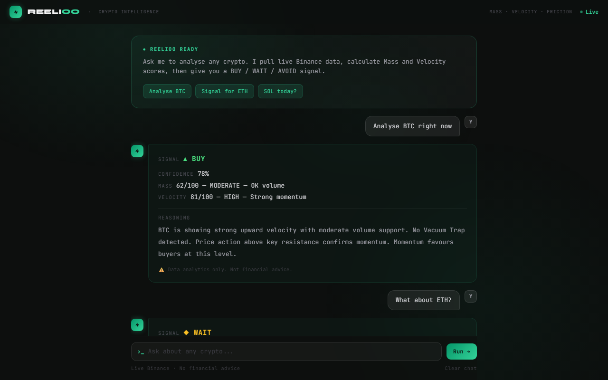
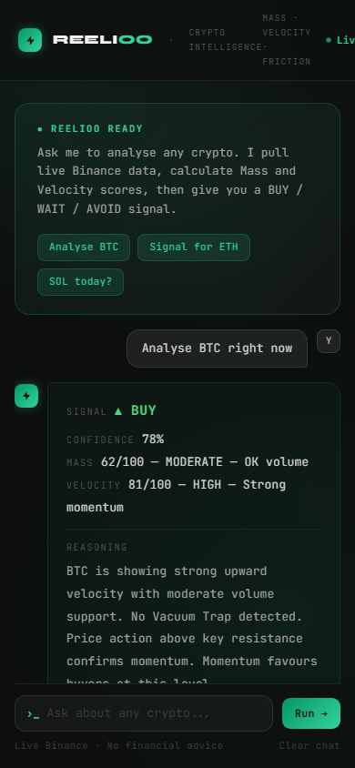

# ⚡ Reelioo — Agentic Crypto Intelligence


> A crypto analysis agent powered by LangChain and GPT-4o-mini. Ask about any coin in plain English — Reelioo pulls live Binance data, calculates Mass and Velocity scores, and returns a clear **BUY / WAIT / AVOID** signal.

---



---

## What It Does

```
You:     Analyse BTC right now

Reelioo: SIGNAL      ▲ BUY
         CONFIDENCE  78%
         MASS        62/100 — MODERATE — OK volume
         VELOCITY    81/100 — HIGH — Strong momentum

         REASONING
         BTC is showing strong upward velocity with moderate volume support.
         No Vacuum Trap detected. Price action above key resistance confirms
         momentum. Momentum favours buyers at this level.
```

The agent **remembers your conversation** — ask follow-up questions and it keeps full context across the session.

---

## Mobile



---

## How It Works

Reelioo runs a LangChain agent loop with 3 live Binance tools:

```
User asks about BTC
        │
        ▼
Agent calls get_crypto_price("BTC")      → live price, 24h change, high/low, volume
        │
        ▼
Agent calls get_market_momentum("BTC")   → Velocity score 0–100, direction
        │
        ▼
Agent calls get_volume_analysis("BTC")   → Mass score 0–100, Vacuum Trap check
        │
        ▼
GPT-4o-mini reasons over all 3 results
        │
        ▼
Returns: SIGNAL · CONFIDENCE · MASS · VELOCITY · REASONING
```

**Thread ID + Flask session** keeps conversation context alive — the agent remembers what it said so you can ask follow-ups like *"why did you say WAIT?"* or *"compare that to ETH"*.

---

## The Physics Logic

Reelioo interprets raw market data through three forces:

| Force | What it measures |
|---|---|
| **Mass** | Volume behind a price move. High = real buyers present. Low = **Vacuum Trap** — price moved without conviction, likely to reverse |
| **Velocity** | Speed of orders hitting the market. High = strong momentum. Low = passive, weak market |
| **Friction** | Where price gets stuck — resistance zones the agent flags in reasoning |

### Vacuum Trap
When price moves more than 2% but volume is below 70% of average — Reelioo flags this as a **Vacuum Trap**. The move has no mass behind it and is historically likely to reverse.

### Loading Signal
When volume is building above 180% of average but price is flat — Reelioo flags **Loading**. Energy is accumulating for a breakout.

---

## Stack

| Layer | Technology |
|---|---|
| **AI Agent** | LangChain · GPT-4o-mini · Tool calling |
| **Market Data** | Binance public API (no key needed) |
| **Backend** | Flask · Python 3.12 · Gunicorn |
| **Frontend** | HTMX · Tailwind CSS · Jinja2 |
| **Deployment** | Railway |

---

## Try It

**Live app → [reelioo.app](https://reelioo.app)**

Or run it yourself:

```bash
git clone https://github.com/agenticmohit/reelioo.git
cd reelioo
uv sync
cp .env.example .env        # add your OPENAI_API_KEY in .env
uv run python app.py        # open http://localhost:5000
```

---

## Project Structure

```
reelioo/
├── app.py                  # Flask app — routes, HTMX endpoints, session
├── agent.py                # LangChain agent — tools wired to GPT-4o-mini
├── tools.py                # 3 Binance tools: price, momentum, volume
├── templates/
│   ├── index.html          # Terminal-style chat UI (HTMX + Tailwind)
│   ├── _thinking.html      # User bubble + animated thinking indicator
│   ├── _ai_message.html    # AI response bubble with signal formatting
│   └── _messages.html      # Session history partial
├── screenshots/
│   ├── hero.png
│   └── mobile.png
├── pyproject.toml
└── .env.example
```

---

*Built with LangChain · OpenAI · Binance API · No financial advice*
